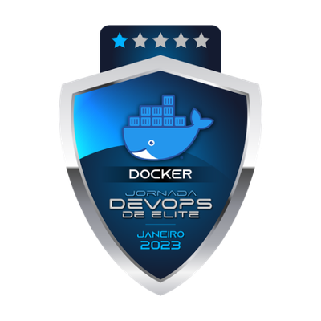
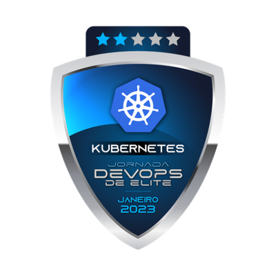
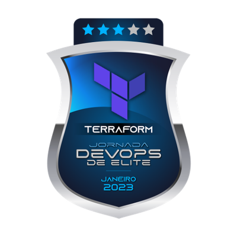
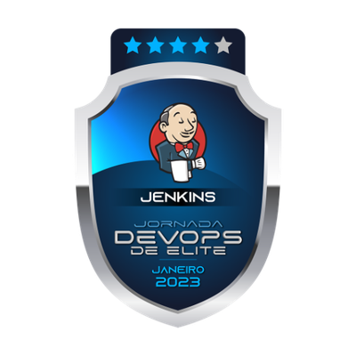
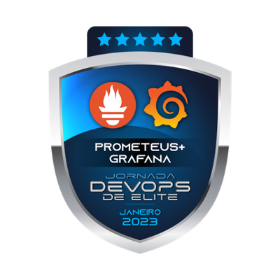

### Hi! How are you? 👋

- 🔭 I’m currently working on **Banco do Brasil**
- 🌱 I’m currently learning **DevOps Tools**
- 📫 How to reach me: **carloshsrosa@gmail.com**
<!-- - 👯 I’m looking to collaborate on ...
- 🤔 I’m looking for help with ...
- 💬 Ask me about ... 
- 😄 Pronouns: ...
- ⚡ Fun fact: ... -->

**Technologies/Tools:**

**Badges:**

